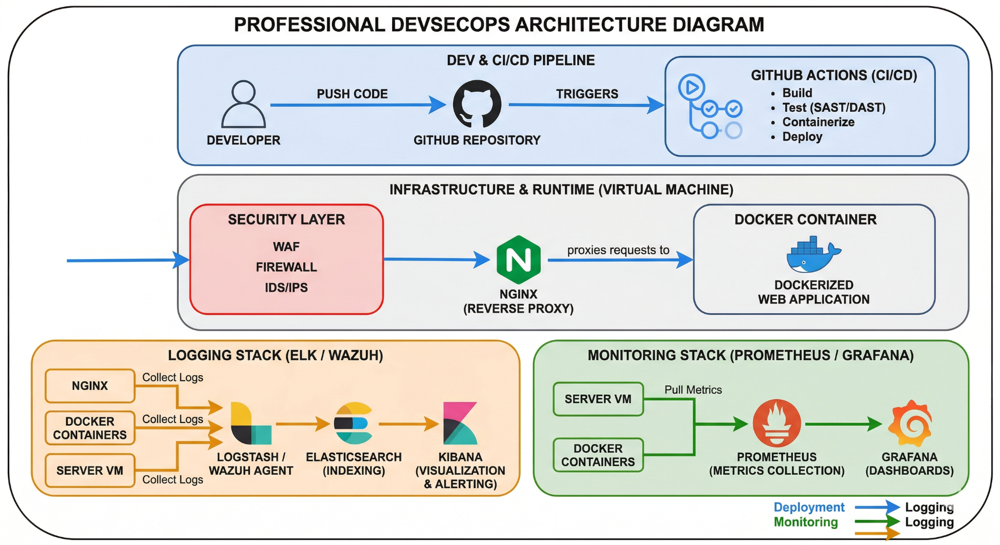

# DevSecOps Infrastructure Architecture - Day 1

## Overview

This document presents the DevOps architecture of the project, focusing on application deployment, automation, monitoring, and logging.

The goal is to build a reproducible, automated, and observable infrastructure.

---

## Global Architecture

The following diagram illustrates the complete DevOps workflow and infrastructure:

---

## 1. CI/CD Pipeline

The process starts when the developer pushes code to GitHub.

This triggers the CI/CD pipeline (GitHub Actions), which performs:

* Build the application
* Run automated tests
* Perform security scans (integration point)
* Build Docker image
* Deploy to the server

This ensures automation and consistent delivery.

---

## 2. Deployment Infrastructure (VM)

The application is deployed on a Virtual Machine.

* The server hosts Docker and all services
* It acts as the runtime environment

---

## 3. Reverse Proxy (Nginx)

* Nginx acts as the entry point of the system
* It receives incoming HTTP requests
* It routes traffic to the application containers

---

## 4. Application Layer (Docker)

* The application is containerized using Docker
* Docker ensures:

  * Portability
  * Reproducibility
  * Isolation

The application runs inside Docker containers.

---

## 5. Logging System

Logs are collected from:

* Nginx
* Docker containers
* Server

They are processed and visualized using:

* ELK Stack or Wazuh

This enables centralized logging and troubleshooting.

---

## 6. Monitoring System

Monitoring is implemented using:

* Prometheus (metrics collection)
* Grafana (visualization)

Metrics include:

* CPU usage
* Memory usage
* Container status
* Service availability

---

## 7. System Flows

### Deployment Flow

Developer → GitHub → CI/CD → Server → Docker → Application

### Request Flow

User → Nginx → Application

### Monitoring Flow

Server/Containers → Prometheus → Grafana

### Logging Flow

Services → ELK / Wazuh

---

## Conclusion

This architecture provides a complete DevOps foundation including:

* Automated deployment (CI/CD)
* Containerized applications (Docker)
* Centralized logging
* Real-time monitoring

It ensures a reliable and scalable infrastructure.
