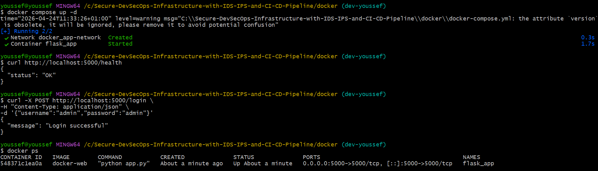
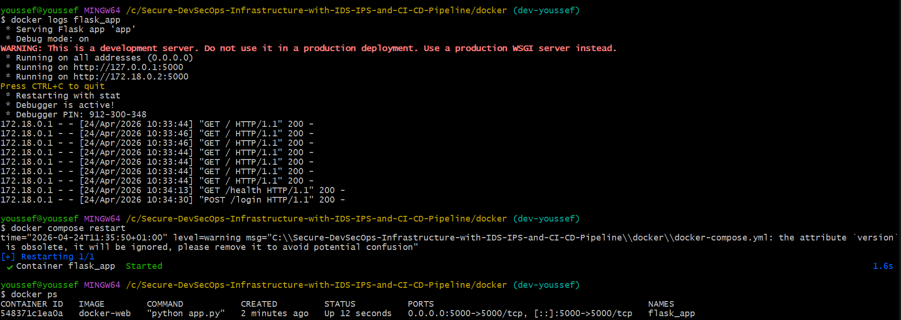
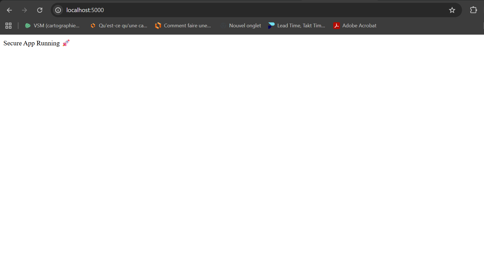

#  Day 10 — Baseline Documentation

## Objective
Define the normal behavior of the application before adding security layers.

---

## Tests Performed

### Healthcheck
Result: {"status": "OK"}

### Login
Result: Login successful

---

##  Docker Status

Container is running and port 5000 is exposed.

---

##  Logs

Logs show normal requests and Flask running.

---

##  Application Access

Accessible at http://localhost:5000

---

##  Restart Test

docker compose restart → OK

---

##  Failure Test

docker compose down → App not accessible

---

##  Baseline Summary

- App runs on port 5000
- Healthcheck OK
- Login works
- Logs normal
- Restart OK
- Stop OK

---

##  Conclusion

This baseline will be used for comparison after adding security layers.
