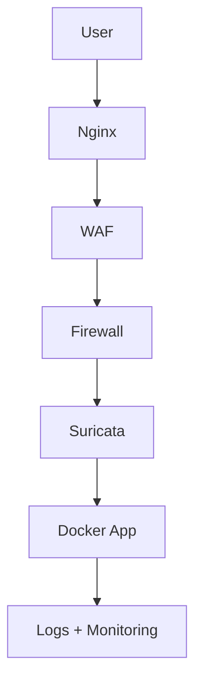

# Security Architecture Diagram - Day 1

## Text Flow

```text
User
 ↓
Nginx
 ↓
WAF
 ↓
Firewall
 ↓
Suricata
 ↓
Docker (App)
 ↓
Logs + Monitoring
```

## Mermaid Diagram



## Quick Validation

- ✔ Each component has a defined security role.
- ✔ The request and response flow is clear from the internet edge to the application layer.
- ✔ Main attack entry points are identifiable through HTTP/HTTPS, SSH, application endpoints, and CI/CD access.
- ✔ Validated for Day 1 documentation.
