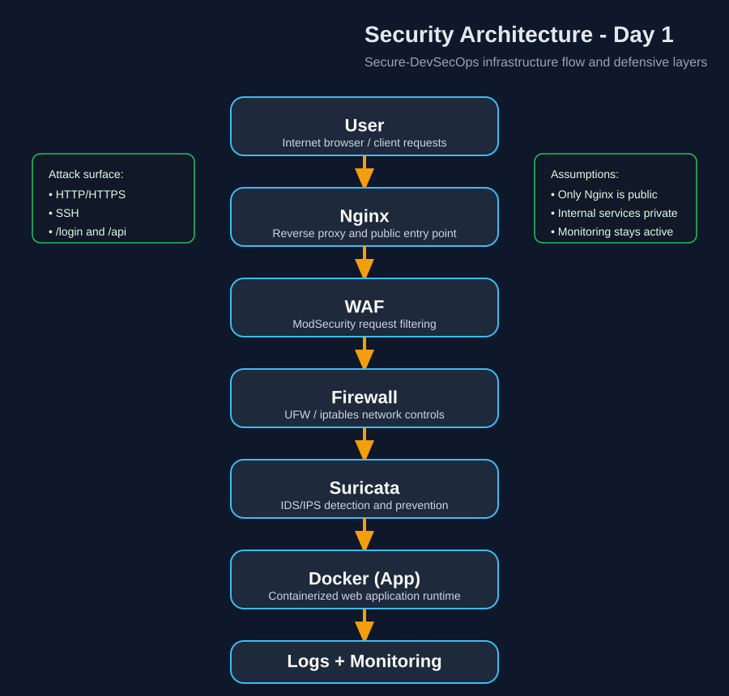
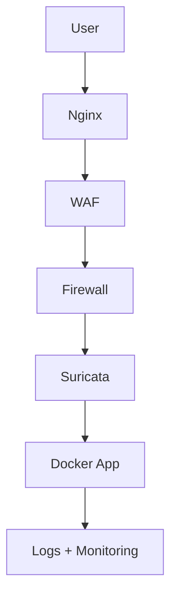

# Security Architecture Diagram - Day 1

## Diagram Asset

The diagram below is included as a reusable SVG artifact for documentation, reviews, and future updates:



## Text Flow

```text
User
 ↓
Nginx
 ↓
WAF
 ↓
Firewall
 ↓
Suricata
 ↓
Docker (App)
 ↓
Logs + Monitoring
```

## Mermaid Diagram



## Component Roles

| Component | Role |
| --- | --- |
| User | Originates requests from the internet/browser. |
| Nginx | Handles inbound traffic as the public reverse proxy. |
| WAF | Filters malicious HTTP requests before they reach the application. |
| Firewall | Restricts network access to only approved ports and paths. |
| Suricata | Detects and can block suspicious traffic patterns. |
| Docker (App) | Runs the application in an isolated container environment. |
| Logs + Monitoring | Stores events and exposes observability signals for detection and response. |

## Quick Validation

- ✔ Each component has a defined security role.
- ✔ The request and response flow is clear from the internet edge to the application layer.
- ✔ Main attack entry points are identifiable through HTTP/HTTPS, SSH, application endpoints, and CI/CD access.
- ✔ The architecture diagram now exists as a standalone asset in addition to the Markdown version.
- ✔ Validated for Day 1 documentation.

## Collaboration Follow-up

For the requested binôme checkpoint, this architecture note is ready to review with Youssef to confirm alignment with the Docker runtime and CI/CD pipeline decisions.
